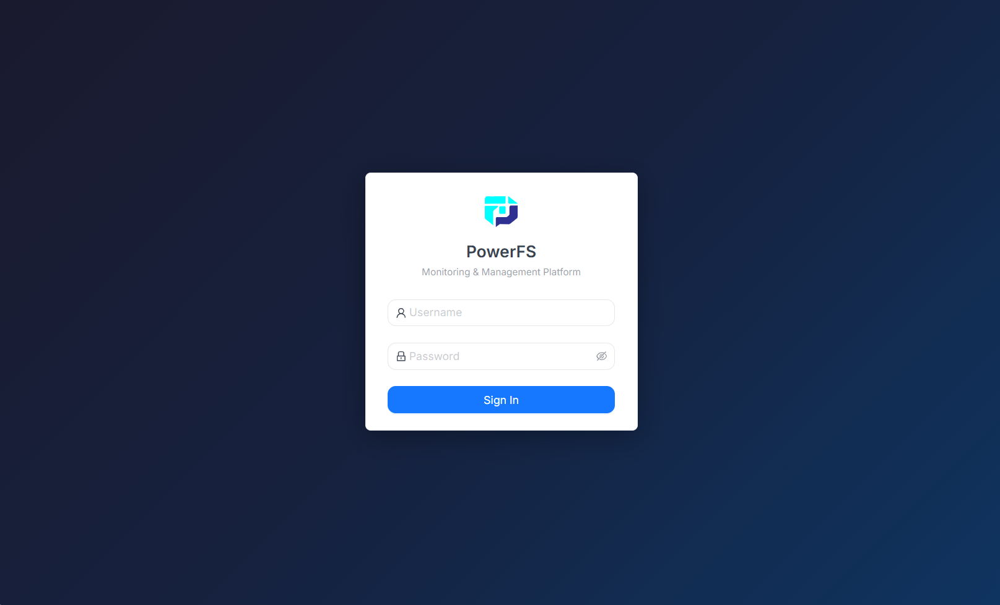
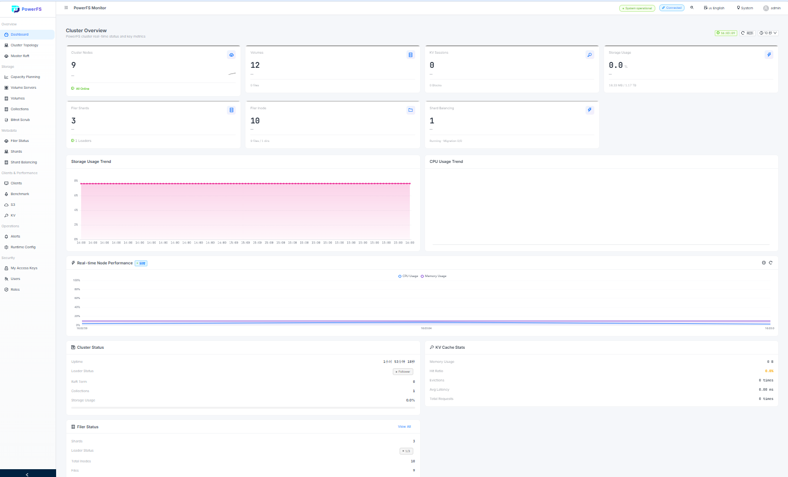
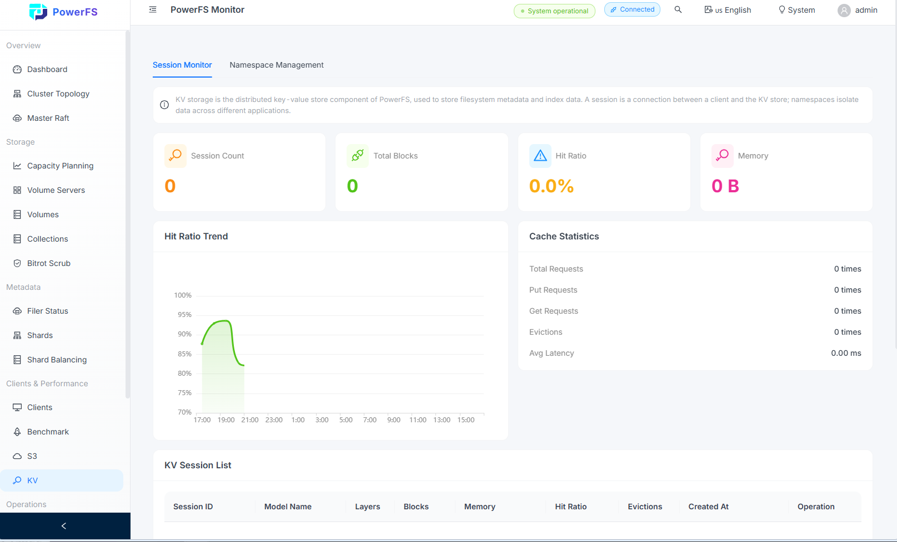

# PowerFS

**One storage for HPC + AI. Rust-native. Zero jitter.**

Unified POSIX / S3 / KV cache in a single cluster — eliminating the three-stack fragmentation that plagues HPC+AI converged infrastructure.

[Introduction](#introduction) • [Architecture](#architecture) • [Core Features](#core-features) • [Roadmap](#-roadmap) • [Scenarios](#application-scenarios) • [Benchmark](#benchmark) • [Quick Start](#quick-start) • [Articles](articles/) • [License](#license)

---

## Why PowerFS?

| The Problem | The PowerFS Solution |
|---|---|
| HPC storage (Lustre/BeeGFS) can't do AI KV inference | Built-in KV Cache engine + GPU Direct zero-copy |
| Cloud storage (Ceph) lacks POSIX + massive parallel I/O | Filer Raft strong consistency, 10K+ MPI parallel |
| Three isolated stacks = data silos + high cost | One unified architecture, one data pool, one deployment |

---

## Key Features

- **Rust-native, zero GC** — No STW jitter, stable p99 under sustained full load
- **Three interfaces, one data pool** — POSIX (FUSE/Kernel) + S3 + KV cache, stored once, shared everywhere
- **Filer Raft strong consistency** — Linearizable metadata via Raft commit, Leader Lease Read for zero-RTT reads
- **Volume Lease linearizability** — Per-stripe (64MB) exclusive lock, 60s reuse, RAII auto-release
- **NVMe-oF direct + SPDK bare metal** — Bypass Volume Server, connect NVMe-oF Target all-flash array directly; or use Volume Server with SPDK NVMe bare-disk I/O, bypassing kernel filesystem entirely
- **Full hardware offload** — SPDK / RDMA / GPU Direct, end-to-end zero-copy from NVMe to GPU HBM
- **40x metadata performance** — Lock-free optimization, 2M+ ops/s single-thread

---

## Architecture

```
┌──────────────────────────────────────────────────────────────┐
│                    POSIX (FUSE/Kernel) / S3 / KV              │
│                    FuseClientFacade (Unified)                 │
│  ┌────────────┐  ┌──────────────┐  ┌───────────────────────┐ │
│  │MasterClient│  │MetaShardClient│  │    VolumeClient       │ │
│  │ (Topology) │  │(Filer Raft)  │  │  (Read/Write + Lease) │ │
│  └─────┬──────┘  └──────┬───────┘  └──────────┬────────────┘ │
└────────┼────────────────┼─────────────────────┼──────────────┘
         │                │ ← Callback Invalidation Push ──┐
         │                │                               │
┌────────▼────────────────▼───────────────────────────────▼────┐
│              Filer (Raft Strong Consistency)                  │
│  Bucket-based sharding, each bucket = independent Raft group  │
│  [Shard 0: Raft+RocksDB] [Shard 1] [Shard N] ...             │
└────────┬────────────────┬───────────────────────────────────┘
┌────────▼────────────────▼───────────────────────────────────┐
│              Master (Raft Scheduling + Volume Routing)        │
└────────┬─────────────────────────────────────────────────────┘
         │
         │  Two storage modes:
         │  ┌─────────────────────────────────────────────────┐
         ▼  ▼                                                 │
┌─────────────────────────────┐  ┌─────────────────────────────┴──┐
│  Mode A: Volume Server      │  │  Mode B: NVMe-oF Direct         │
│  SPDK NVMe bare-disk I/O    │  │  Connect NVMe-oF Target array   │
│  Needle + Lease Lock        │  │  directly, no Volume Server      │
│  [Volume 1] [Volume 2] ...  │  │  All-flash array handles I/O     │
└─────────────────────────────┘  └──────────────────────────────────┘
│  Unified Needle Binary Format + RocksDB Index                │
└──────────────────────────────────────────────────────────────┘
```

**Dual storage modes**:
- **Mode A (Volume Server)**: SPDK NVMe bare-disk I/O, bypassing kernel filesystem — for clusters with local NVMe SSDs
- **Mode B (NVMe-oF Direct)**: Connect NVMe-oF Target all-flash array directly, bypassing Volume Server entirely — for enterprise all-flash deployments

**Dual consistency**: Filer Raft for metadata (linearizable) + Volume Lease Lock for data (per-stripe 64MB exclusive). Cross-client coherence via Callback Invalidation (Filer pushes to subscribed clients, no broadcast storms).

---

## Quick Start

```bash
git clone https://github.com/powerfs/powerfs.git
cd powerfs/docker

# Build & launch full cluster (Redis + Masters + Volumes + Filers + FUSE)
sudo ./build_powerfs_image.sh
docker compose -f docker-compose.test.yml up -d
```

Or build from source:

```bash
cargo build --release

# 1. Start Redis
docker run -d --name redis -p 6379:6379 redis:7-alpine

# 2. Start 3 Masters (Raft)
./target/release/powerfs-master --config config/master-{1,2,3}.toml

# 3. Start 3 Volumes
./target/release/powerfs-volume --config config/volume-{1,2,3}.toml

# 4. Init Filers (format root inode, run once per Filer)
./target/release/powerfs-init --config config/filer-{1,2,3}.toml

# 5. Start 3 Filers
./target/release/powerfs-filer --config config/filer-{1,2,3}.toml

# 6. Mount
./target/release/powerfs-fuse --config config/fuse.toml
```

**Default credentials**: admin / admin123 · **S3**: powerfs / powerfs123 @ http://localhost:9000

---

## Architecture

PowerFS adopts a **three-layer decoupled, Filer Raft strong-consistency + Cap model distributed locking, three-interface unified** overall architecture, realizing complete separation of control plane and data plane:

### 3-Layer Decoupled Architecture

```
┌────────────────────────────────────────────────────────────┐
│                      Client Layer                          │
│  ┌──────────┐  ┌──────────┐  ┌──────────────────────────┐  │
│  │  FUSE    │  │    S3    │  │      KV Cache Client     │  │
│  │ (POSIX)  │  │  Client  │  │    (for LLM Inference)   │  │
│  └────┬─────┘  └────┬─────┘  └───────────┬──────────────┘  │
└───────┼─────────────┼────────────────────┼─────────────────┘
        │             │                    │
┌───────▼─────────────▼────────────────────▼─────────────────┐
│    Filer Raft Strong-Consistency Metadata Layer (Core)      │
│  ┌──────────────────────────────────────────────────────┐  │
│  │  Bucket Sharding | Cap Model | lock_arbiter          │  │
│  │  Callback Invalidation Push | Multi-Protocol Isolation│  │
│  └──────────────────────────────────────────────────────┘  │
└─────────────────────────────┬──────────────────────────────┘
                              │
┌─────────────────────────────▼──────────────────────────────┐
│              Master (Raft Scheduling + CA + Volume Routing)  │
│              (High-Availability Cluster)                   │
│  ┌──────────────────────────────────────────────────────┐  │
│  │  Cluster Mgmt | Resource Alloc | Topology | CA Cert  │  │
│  └──────────────────────────────────────────────────────┘  │
└─────────────────────────────┬──────────────────────────────┘
                              │
┌─────────────────────────────▼──────────────────────────────┐
│             Multi-Interface Unified Data Layer             │
│  ┌──────────────┐  ┌──────────────┐  ┌──────────────┐      │
│  │  Volume 1    │  │  Volume 2    │  │  Volume N    │      │
│  │  (Needle)    │  │  (Needle)    │  │  (Needle)    │      │
│  └──────────────┘  └──────────────┘  └──────────────┘      │
│               [Unified Needle Binary Format + RocksDB]     │
└────────────────────────────────────────────────────────────┘
```

1. **Filer Raft Strong-Consistency Metadata Layer (Core)**: The heart of PowerFS architecture. Bucket-based sharding where each bucket is an independent Raft group. All metadata operations (mkdir, create, unlink, setattr, content_size, chunks) go through Raft commit for linearizability. Cap model + lock_arbiter manages distributed write locks; Callback Invalidation push ensures cross-client cache coherence without broadcast storms.

## Benchmark

> After Filer Raft strong-consistency refactor. Tests run with standard `fio` and `io500` in container environment.

### Metadata Performance (Lock-Free Optimization)

| Operation | Community (Single Lock) | Enterprise (Lock-Free) | Speedup |
|---|---|---|---|
| Single-thread mkdir+lookup+rmdir | ~50K ops/s | **~2M ops/s** | **40x** |
| Multi-thread (8) mkdir+lookup+rmdir | ~10K ops/s | **~550K ops/s** | **55x** |
| list_dir (10K entries) | ~50ms | **~4.7ms** | **10.6x** |

### GPU Utilization

- LLM inference GPU utilization: **40-50% → 90%+** (with KV cache engine)

### Comparison

| Storage | HPC Parallel | AI KV Inference | Multi-Protocol | Jitter |
|---|---|---|---|---|
| Lustre/BeeGFS | Excellent | Poor | Single protocol | Medium |
| Ceph/CubeFS | Weak | Medium | Fake multi-protocol | High |
| **PowerFS** | **Excellent** | **Excellent** | **True unified** | **Zero** |

---

## Application Scenarios

- **HPC Supercomputing**: MPI parallel simulation, fluid dynamics, meteorology
- **AI Training**: Massive dataset loading, model checkpoint I/O
- **LLM Inference**: KV cache offloading, long-context acceleration, GPU memory extension
- **Converged Data Center**: One storage pool for HPC + AI workloads

---

## Getting Started

### Prerequisites

- Rust 1.75+ (with cargo)
- Protobuf compiler (`protoc`)
- FUSE 2.x development libraries (for FUSE client)
- Linux kernel headers (for FUSE)
- Docker & Docker Compose (for containerized deployment)

#### Ubuntu/Debian

```bash
sudo apt-get update && sudo apt-get install -y \
    protobuf-compiler \
    libfuse-dev \
    linux-headers-generic \
    docker.io \
    docker-compose-plugin
```

#### CentOS/RHEL

```bash
sudo yum install -y \
    protobuf-compiler \
    fuse-devel \
    docker \
    docker-compose-plugin
```

### Build

```bash
# Clone the repository
git clone https://github.com/powerfs/powerfs.git
cd powerfs

# Build all packages
cargo build --all

# Build in release mode (recommended for production)
cargo build --all --release

# Build individual components
cargo build -p powerfs-master
cargo build -p powerfs-volume
cargo build -p powerfs-filer
cargo build -p powerfs-fuse
cargo build -p powerfs-init
```

### Component Architecture

PowerFS adopts a **multi-binary independent deployment** architecture, where each service runs as an independent process:

| Component | Binary | Port | Description |
|-----------|--------|------|-------------|
| **Master** | `powerfs-master` | 9333 (gRPC), 9334 (net) | Cluster control plane, Raft scheduling, Volume routing |
| **Volume** | `powerfs-volume` | 8080 (gRPC), 8091 (http), 8901 (net) | Data storage plane, Needle storage, Lease lock management |
| **Filer** | `powerfs-filer` | 8888 (S3), 8889 (gRPC), 8890 (net) | Metadata sharding, Raft strong consistency, S3 gateway |
| **FUSE** | `powerfs-fuse` | Userspace FUSE | POSIX interface client, three-client communication architecture |
| **Init** | `powerfs-init` | None | Independent initialization tool, formats POSIX root inode |
| **CLI** | `powerfs-cli` | None | Command-line management tool |

### Configuration

All services use **unified TOML configuration files** with no hardcoded default values. Configuration priority: CLI parameters > configuration file > default values (configuration must explicitly specify all ports and addresses).

#### Configuration Example (master-1.toml)

```toml
[global]
log_level = "info"
redis_url = "redis://127.0.0.1:6379"

[master]
port = 9333                    # HTTP/gRPC端口
raft_port = 9335              # Raft端口 (必须与port不同)
metrics_port = 9300           # Metrics/Admin HTTP端口 (cert API挂载于此)
net_port = 9334               # powerfs-net TLV端口
dir = "/data/master"
ip = "0.0.0.0"
raft_id = 1
advertise_addr = "192.168.1.100:9333"
raft_peers = [
    "192.168.1.100:9335",
    "192.168.1.101:9335",
    "192.168.1.102:9335",
]
admin_token = "your-admin-secret"        # 管理API认证令牌 (CLI cert命令需要)
ca_dir = "/data/master/ca"              # CA证书存储目录
registration_token = "your-cluster-token" # 节点注册认证令牌
```

### Quick Start (Single Node)

> **Note**: Single-node mode is for development/testing only. Production environments must use 3+ Raft nodes.

```bash
# Step 1: Start Redis (metadata cache)
docker run -d --name redis -p 6379:6379 redis:7-alpine

# Step 2: Start Master node
./target/release/powerfs-master --config config/master-single.toml

# Step 3: Start Volume node
./target/release/powerfs-volume --config config/volume-single.toml

# Step 4: Initialize Filer metadata (format POSIX root BEFORE starting Filer)
./target/release/powerfs-init --config config/filer-single.toml

# Step 5: Start Filer node
./target/release/powerfs-filer --config config/filer-single.toml

# Step 6: Mount FUSE filesystem
./target/release/powerfs-fuse --config config/fuse-single.toml

# Step 7: Test
ls /mnt/powerfs
echo "hello PowerFS" > /mnt/powerfs/test.txt
cat /mnt/powerfs/test.txt
```

### Quick Start (3-Node Raft Cluster)

```bash
# Step 1: Start Redis
docker run -d --name redis -p 6379:6379 redis:7-alpine

# Step 2: Start 3 Master nodes
./target/release/powerfs-master --config config/master-1.toml
./target/release/powerfs-master --config config/master-2.toml
./target/release/powerfs-master --config config/master-3.toml

# Step 3: Start 3 Volume nodes
./target/release/powerfs-volume --config config/volume-1.toml
./target/release/powerfs-volume --config config/volume-2.toml
./target/release/powerfs-volume --config config/volume-3.toml

# Step 4: Initialize 3 Filer nodes (format POSIX root BEFORE starting Filers)
./target/release/powerfs-init --config config/filer-1.toml
./target/release/powerfs-init --config config/filer-2.toml
./target/release/powerfs-init --config config/filer-3.toml

# Step 5: Start 3 Filer nodes
./target/release/powerfs-filer --config config/filer-1.toml
./target/release/powerfs-filer --config config/filer-2.toml
./target/release/powerfs-filer --config config/filer-3.toml

# Step 6: Mount FUSE
./target/release/powerfs-fuse --config config/fuse.toml
```

### Run Each Component

#### Master Node

```bash
# Single node (development)
powerfs-master --config config/master-single.toml

# 3-node Raft cluster
powerfs-master --config config/master-1.toml
powerfs-master --config config/master-2.toml
powerfs-master --config config/master-3.toml
```

#### Volume Node

```bash
powerfs-volume --config config/volume-1.toml
powerfs-volume --config config/volume-2.toml
powerfs-volume --config config/volume-3.toml
```

#### Initialize Tool (powerfs-init)

Follows the **mkfs → mount** pattern. **Must run BEFORE starting Filer**. Directly operates RocksDB to create the POSIX root inode:

```bash
# Initialize Filer metadata (creates POSIX root inode = /)
powerfs-init --config config/filer-1.toml

# Force overwrite existing data
powerfs-init --config config/filer-1.toml --force
```

> **Important**: `powerfs-init` uses the SAME config file as `powerfs-filer` to ensure path consistency.

#### Filer Node

```bash
# Start after powerfs-init has formatted the data
powerfs-filer --config config/filer-1.toml
powerfs-filer --config config/filer-2.toml
powerfs-filer --config config/filer-3.toml
```

#### FUSE Client

```bash
powerfs-fuse --config config/fuse.toml
```

#### CLI Tool

```bash
# Check cluster status
powerfs-cli --config config/master-1.toml status

# List volumes
powerfs-cli --config config/master-1.toml volumes

# Create bucket
powerfs-cli --config config/master-1.toml create-bucket my-bucket

# Certificate management (requires admin_token)
powerfs-cli cert init-ca --master-api master-1:9300 --admin-token "your-admin-secret" -o /etc/powerfs/certs/
powerfs-cli cert sign-client --master-api master-1:9300 --admin-token "your-admin-secret" \
  --common-name "fuse-client-1" -o /etc/powerfs/certs/
powerfs-cli cert sign-server --master-api master-1:9300 --admin-token "your-admin-secret" \
  --common-name "filer-1" --san 172.20.0.31 -o /etc/powerfs/certs/
```

### Security & Authentication

PowerFS uses a **three-tier authentication** model:

| Layer | Auth Method | Scope | Config Field |
|-------|-----------|-------|-------------|
| **admin_token** | Bearer Token (HTTP) | CLI management API, cert signing | `master.admin_token` |
| **registration_token** | TLV FieldId 0xD3 | Volume/Filer node registration | `master/volume/filer.registration_token` |
| **ClientId** | Master-assigned ID | FUSE client mount, Cap authorization | Runtime (no config) |

- **Master CA**: Master acts as cluster Certificate Authority (rcgen self-signed CA), signs client/server TLS certs via HTTP API (`/api/cert/ca`, `/api/cert/sign-client`, `/api/cert/sign-server`)
- **Dev mode**: Empty/None tokens = no auth (for development only)
- **Production**: Set non-empty `admin_token` and `registration_token`; use CLI cert commands to manage TLS certificates

### Docker Deployment (Recommended)

PowerFS provides Docker Compose configuration for quick multi-node cluster deployment:

```bash
# Clone the repository
git clone https://github.com/powerfs/powerfs.git
cd powerfs/docker

# Build Docker images
sudo ./build_powerfs_image.sh

# Start the test environment (Redis + Masters + Volumes + Init + Filers + FUSE)
docker compose -f docker-compose.test.yml up -d

# Stop the test environment
docker compose -f docker-compose.test.yml down
```

**Service Ports**:
| Service | Container Port | Host Port (Test) |
|---------|---------------|------------------|
| Redis | 6379 | 6380 |
| Master-1 | 9333 (gRPC), 9334 (net) | 9433 |
| Master-2 | 9333, 9334 | 9434 |
| Master-3 | 9333, 9334 | 9435 |
| Volume-1 | 8080 (gRPC), 8091 (http), 8901 (net) | 8180, 8191 |
| Volume-2 | 8080, 8091, 8901 | 8181, 8192 |
| Volume-3 | 8080, 8091, 8901 | 8182, 8193 |
| Filer-1 | 8888 (S3), 8889 (gRPC), 8890 (net) | 8988, 8989, 8990 |
| Filer-2 | 8888, 8889, 8890 | 8991, 8992, 8993 |
| Filer-3 | 8888, 8889, 8890 | 8994, 8995, 8996 |
| FUSE | Mount at /mnt/fuse | - |

**Deployment Order**:
1. **Wave 1**: Redis
2. **Wave 2**: Masters (all 3 start simultaneously for Raft)
3. **Wave 3a**: Volumes
4. **Wave 3b**: Init-Filers (format metadata, run once)
5. **Wave 4**: Filers (start after init completes)
6. **Wave 5**: FUSE client

> **Key Principle**: Formatting is handled by the `powerfs-init` tool. Service startup MUST NOT contain initialization logic.

### Login Information

**Default Credentials**:
- **Username**: `admin`
- **Password**: `admin123`

**S3 Credentials**:
- **Access Key**: `powerfs`
- **Secret Key**: `powerfs123`
- **Endpoint**: http://localhost:9000

### Run Tests

```bash
# Run all tests
cargo test --workspace

# Run tests for specific package
cargo test -p powerfs-core
cargo test -p powerfs-fuse
cargo test -p powerfs-volume

# Run integration tests in Docker (FUSE real mount testing)
docker exec fuse-test /app/powerfs-fuse --config /config/fuse.toml
```

### Web Dashboard

#### Login Page



The login page provides secure access to the monitoring dashboard. Use the default credentials to log in.

#### Dashboard



The main dashboard displays system overview including cluster health status, volume node statistics, active sessions, and recent alerts.

#### KV Management



The KV management page allows you to create and manage namespaces, monitor session activity, view cache statistics and hit rates, and create API access keys.

### Directory Structure

PowerFS uses a hierarchical directory structure to separate different types of data:

```
# Master Node Directory Structure
/data/master/
├── raft/           # Raft consensus log (can be on fast SSD)
│   ├── wal/        # Write-Ahead Log
│   └── snapshot/   # State snapshots
└── meta/           # RocksDB metadata (cluster topology, volume mapping)
    └── *.sst        # RocksDB SST files

# Volume Node Directory Structure
/data/volume/
├── metadata/       # RocksDB metadata (volume info, needle index)
│   └── *.sst       # RocksDB SST files
└── data/           # Actual file data (can be on large capacity disk)
    └── volume_{id}/
        └── data    # Volume data file (append-only Needle storage)

# Filer Node Directory Structure
/data/filer/
├── raft/           # Raft consensus log (metadata shard Raft)
├── shards/         # Shard metadata storage
│   ├── shard_0_data/  # RocksDB for shard 0
│   │   └── *.sst
│   ├── shard_1_data/  # RocksDB for shard 1
│   │   └── *.sst
│   └── ...
```

**Directory Separation Benefits:**
- Place raft logs on fast SSD for better consensus performance
- Place metadata on fast SSD for quick lookups
- Place data files on large capacity disks
- Filer shards separated by inode range for independent scaling

### Project Source Structure

```
powerfs/
├── powerfs-common/      # Common types, config, error handling, TLV protocol
├── powerfs-net/         # Network layer: TLV codec, TCP server/client, connection management
├── powerfs-master/      # Master service: Raft scheduling, Volume routing, S3 gateway
├── powerfs-volume/      # Volume service: Needle storage, Lease lock, RocksDB index
├── powerfs-filer/       # Filer service: Raft strong consistency metadata shards, S3 API, gRPC meta service
├── powerfs-fuse/        # FUSE client: POSIX interface, cache management, InvalidateHandler
├── powerfs-fuse-core/   # FUSE client core: MasterClient, MetaShardClient, VolumeClient, LeaseManager
├── powerfs-init/        # Init tool: Format POSIX root inode before Filer startup
├── powerfs-cli/         # CLI tool: Cluster management commands (fsck, compact, etc.)
├── powerfs-monitor/     # Monitor: Health check, metrics, alerts
├── powerfs-kv-client/   # KV client: Native KV cache engine
├── powerfs-orset/       # Shared data structures (CachedFileChunk, FileType, etc.)
├── powerfs-coherence/   # Coherence: Generic metadata sync interfaces (DeltaSyncChannel)
├── powerfs-master-net/  # Master net: TLV protocol client (TlvMasterClient) for FUSE/kernel
├── powerfs-s3/          # S3 protocol implementation
├── rfs_tester/          # Integration test tool
├── docker/              # Docker Compose configs and deployment scripts
├── config/              # Example configuration files (TOML)
└── Cargo.toml           # Workspace manifest
```

### Command Line Options

All components use `--config` to load TOML configuration files. No hardcoded default values.

#### powerfs-master

```
PowerFS Master Node - Cluster control plane with Raft consensus

Usage: powerfs-master --config <CONFIG>

Options:
  -c, --config <CONFIG>  Path to TOML configuration file (required)
  -h, --help             Print help
  -V, --version          Print version
```

#### powerfs-volume

```
PowerFS Volume Node - Data storage with Needle format and Lease locks

Usage: powerfs-volume --config <CONFIG>

Options:
  -c, --config <CONFIG>  Path to TOML configuration file (required)
  -h, --help             Print help
  -V, --version          Print version
```

#### powerfs-filer

```
PowerFS Filer Node - Metadata sharding, Raft strong consistency, S3 gateway

Usage: powerfs-filer --config <CONFIG>

Options:
  -c, --config <CONFIG>  Path to TOML configuration file (required)
  -h, --help             Print help
  -V, --version          Print version
```

#### powerfs-fuse

```
PowerFS FUSE Client - POSIX interface to PowerFS cluster

Usage: powerfs-fuse --config <CONFIG>

Options:
  -c, --config <CONFIG>  Path to TOML configuration file (required)
  -h, --help             Print help
  -V, --version          Print version
```

#### powerfs-init

```
PowerFS Init Tool - Format POSIX root inode BEFORE Filer startup

Usage: powerfs-init --config <CONFIG> [--force]

Options:
  -c, --config <CONFIG>  Path to Filer TOML configuration file (required)
  -f, --force             Overwrite existing data (WARNING: destroys metadata!)
  -h, --help              Print help
  -V, --version           Print version
```

#### powerfs-cli

```
PowerFS CLI - Cluster management tool

Usage: powerfs-cli --config <CONFIG> <COMMAND>

Commands:
  status          Check cluster health
  volumes         List all volumes
  create-bucket   Create a new bucket
  delete-bucket   Delete a bucket
  cert            Certificate management (init-ca, sign-client, sign-server)
  help            Print help

Options:
  -c, --config <CONFIG>  Path to TOML configuration file (required)
  -h, --help             Print help

Cert subcommands (use --master-api <addr:port> --admin-token <token>):
  init-ca         Fetch master CA certificate to local directory
  sign-client     Request master to sign a client certificate
  sign-server     Request master to sign a server certificate
```

## Architecture Details

<details>
<summary>Full Architecture Diagram (click to expand)</summary>

```
┌─────────────────────────────────────────────────────────────────────────────┐
│                           Client Layer (FUSE / S3 / CLI)                     │
│  ┌─────────────────────────────────────────────────────────────────────────┐│
│  │                    FuseClientFacade (Unified Facade)                   ││
│  │  ┌──────────────┐  ┌──────────────┐  ┌──────────────────────────────┐  ││
│  │  │ MasterClient │  │MetaShardClient│  │       VolumeClient            │  ││
│  │  │ (Topology)   │  │ (Raft Strong │  │   (Read/Write + Lease)        │  ││
│  │  │              │  │  Consistency)│  │   LeaseManager trait          │  ││
│  │  └──────┬───────┘  └──────┬───────┘  └──────────────┬───────────────┘  ││
│  └──────────┼────────────────┼─────────────────────────┼──────────────────┘│
└─────────────┼────────────────┼─────────────────────────┼───────────────────┘
              │                │                         │
     ┌────────▼──────┐  ┌─────▼──────┐  ┌──────────────▼─────────────────┐
     │ powerfs-net    │  │ powerfs-net│  │        powerfs-net (TLV 4GB)    │
     │ (TCP + TLV)    │  │ (TCP+TLV)  │  │   Transport trait (TCP/RDMA)    │
     └────────┬───────┘  └─────┬──────┘  └──────────────────────────────────┘
              │                │                         │
              │                │ ←─── Callback Invalidation Push ──┐
              │                │                                    │
┌─────────────▼────────────────▼─────────────────────────────────────▼────────┐
│              Filer Layer (Raft Strong Consistency + S3 Gateway)              │
│  ┌─────────────────────────────────────────────────────────────────────────┐│
│  │  MetaShardManager | RaftGroupManager | InodeNotifier (Callback Push)    ││
│  │  S3Handler | FilerNetHandler | ShardScheduler | BucketManager           ││
│  └─────────────────────────────────────────────────────────────────────────┘│
│  ┌─────────────┐  ┌─────────────┐  ┌─────────────┐                         │
│  │  Shard 0    │  │  Shard 1    │  │  Shard N    │  (Bucket-based         │
│  │ (Raft +     │  │ (Raft +     │  │ (Raft +     │   sharding, each       │
│  │  RocksDB)   │  │  RocksDB)   │  │  RocksDB)   │   bucket = Raft group) │
│  └─────────────┘  └─────────────┘  └─────────────┘                         │
└─────────────────────────────────────────────────────────────────────────────┘
              │                │
┌─────────────▼────────────────▼─────────────────────────────────────────────┐
│              Master Layer (Raft Scheduling + Volume Routing)                │
│  ┌─────────────────────────────────────────────────────────────────────────┐│
│  │  VolumeRouter | ClusterTopology | Raft Consensus | S3 Gateway           ││
│  │  VolumeAssigner | ResilientMasterClient (Leader Discovery)              ││
│  └─────────────────────────────────────────────────────────────────────────┘│
└─────────────────────────────────────────────────────────────────────────────┘
              │
┌─────────────▼─────────────────────────────────────────────────────────────┐
│              Volume Layer (Needle Storage + Lease Lock)                    │
│  ┌─────────────┐  ┌─────────────┐  ┌─────────────┐                         │
│  │  Volume 1   │  │  Volume 2   │  │  Volume N   │                         │
│  │ (Needle +   │  │ (Needle +   │  │ (Needle +   │                         │
│  │  Cap Model) │  │  Cap Model) │  │  Cap Model) │                         │
│  └─────────────┘  └─────────────┘  └─────────────┘                         │
│       [Unified Needle Binary Format + RocksDB Index + Cap Model]          │
└─────────────────────────────────────────────────────────────────────────────┘
```

</details>

<details>
<summary>Dual Consistency Model (click to expand)</summary>

```
┌─────────────────────────────────────────────────────────────────────┐
│                      Dual Consistency Paths                        │
├─────────────────────────┬───────────────────────────────────────────┤
│  Strong Consistency    │  Linearizability                           │
│  (Filer Raft)          │  (Volume Lease Lock)                      │
├─────────────────────────┼───────────────────────────────────────────┤
│  • mkdir/create/unlink │  • File data (read/write/close/flush)     │
│  • rename/readdir      │  • Per-stripe (64MB) Lease Lock           │
│  • lookup/setattr      │  • Follower acquires Lease from Leader    │
│  • content_size, chunks│  • Lease response carries chunk list      │
│  • Leader Lease Read   │  • Lease auto-renew + grace period        │
│  • 3+ nodes Raft       │  • close syncs size/chunks before release │
├─────────────────────────┴───────────────────────────────────────────┤
│  Cross-Client Coherence: Callback Invalidation (Filer → Client)    │
│  • Subscription on Lookup/ReadDir/Create/Mkdir                     │
│  • Invalidate push on setattr/size_chunks sync                     │
│  • Pinned inode + dirty chunk protection                           │
│  • TTL bypass for non-open files getattr                           │
└─────────────────────────────────────────────────────────────────────┘
```

</details>

<details>
<summary>TLV Protocol Stack (click to expand)</summary>

```
┌─────────────────────────────────────────────────────────┐
│  TLV Protocol (Tag 2B + Length 4B + Value max 4GB)     │
├─────────────────────────────────────────────────────────┤
│  FieldId System                                        │
│  • Ino, Name, FileKey, Size, Mode, Uid, Gid, ...       │
│  • Extensible: custom tags for future features         │
├─────────────────────────────────────────────────────────┤
│  Transport Layer (TCP with tokio)                      │
│  • Multiplexed channels (data/lease/mgmt)              │
│  • Circuit breaker for fault tolerance                 │
│  • Automatic reconnection and retry                    │
└─────────────────────────────────────────────────────────┘
```

</details>

---

## 🚀 Roadmap

### Phase 1: Core Framework (Completed)
- [x] Multi-binary architecture (Master, Volume, Filer, FUSE, Init)
- [x] TOML configuration-driven deployment (no hardcoded defaults)
- [x] Three-client communication architecture (MasterClient, MetaShardClient, VolumeClient)
- [x] FuseClientFacade unified facade

### Phase 2: Data Consistency (Completed)
- [x] Lease lock mechanism with auto-renew heartbeat
- [x] Per-stripe (64MB) Lease Lock for data linearizability
- [x] Dual consistency paths (Filer Raft strong + Volume Lease linearizability)
- [x] SetAttr split (SetAttrData → Raft, SetAttrMeta → Callback Invalidation)
- [x] Callback Invalidation mechanism for cross-client cache coherence
- [x] MetadataCache TTL fallback (2s) + TTL bypass for non-open files

### Phase 3: Protocol & Storage (Completed)
- [x] TLV protocol extension (2B+4B+4GB) with bytes::Bytes zero-copy
- [x] Volume RocksDB index migration (from sled)
- [x] L1 crash recovery (WAL auto-recovery)
- [x] Independent init tool (powerfs-init, mkfs→mount pattern)
- [x] Raft 3-node deployment configuration
- [x] Transport trait abstraction (TCP/RDMA/QUIC unified interface)

### Phase 4: Strong Consistency Refactor (Completed 2026-08)
- [x] **Filer Raft strong consistency**: All metadata operations go through Raft commit
- [x] **MetadataClient trait**: Typed metadata API replacing raw TLV submit
- [x] **LeaseManager trait**: Unified read/write lease management with RAII LeaseHandle
- [x] **Callback Invalidation**: Filer → Client push for cross-client cache coherence
- [x] **Bucket-based sharding**: Each bucket = independent Raft group, cross-shard returns EXDEV
- [x] **Creator subscription**: Filer Create/Mkdir establishes subscription for Invalidate notifications
- [x] **Cross-client read visibility**: open-time getattr bypasses TTL + lease response carries chunk list
- [x] **fsck tool**: Scans orphaned inodes/chunks, idempotent deletion (NeedleNotFound = success)
- [x] Real FUSE mount end-to-end testing (3-round system correctness tests passed)
- [x] fio performance benchmark (Phase 2 results documented)
- [x] IO500 moderate config full run (all phases completed, exit 0)
- [x] Multi-node Raft failover testing

### Phase 4b: Security & Authentication (Completed 2026-08)
- [x] **Three-tier authentication**: admin_token (management API) + registration_token (node registration) + ClientId (client mount)
- [x] **Master CA**: Master acts as cluster CA, rcgen self-signed certificate generation
- [x] **Certificate signing HTTP API**: GET /api/cert/ca, POST /api/cert/sign-client, POST /api/cert/sign-server
- [x] **CLI cert commands**: powerfs-cli cert init-ca/sign-client/sign-server with --admin-token
- [x] **Registration token TLV**: FieldId::RegistrationToken (0xD3) in Heartbeat and RegisterFiler
- [x] **Constant-time token comparison**: Anti-timing-attack for both admin_token and registration_token
- [x] **Cap model + lock_arbiter**: Distributed write lock management replacing range/inode lease modes

### Phase 5: Performance & Enterprise Features (In Progress)
- [ ] Random read/write performance optimization (read-before-write overhead reduction)
- [ ] Batch lookup API (find/ls -R scenario optimization)
- [ ] readdir with attr (avoid per-entry getattr)
- [ ] Raft batch commit (multiple writes merged into one log entry)
- [ ] L2 RocksDB Checkpoint (periodic snapshot)
- [ ] L3 remote backup (S3 sync)
- [ ] Volume auto-assignment by Master
- [ ] Rack-aware topology scheduling
- [ ] GPU Direct zero-copy integration
- [ ] RDMA transport implementation (Transport trait RDMA backend)
- [ ] Client lease cache + callback invalidation (Phase 2 optimization if needed)

---

## ⚠️ Known Issues & Lessons Learned

This section records critical issues discovered and resolved during development. Future development MUST pay attention to these patterns to avoid regressions.

### 1. MetadataCache TTL Expiration in readdir

**Symptom**: After mounting FUSE, directory listing returns empty (ENOENT) within 2 seconds.

**Root Cause**: In [cache.rs](file:///home/portion/powerfs/powerfs-fuse/src/cache.rs), the `insert` method did not update `cached_at` on existing cache entries. When the same inode was re-inserted (e.g., during readdir refresh), the stale `cached_at` caused the 2-second TTL to expire immediately.

**Fix**: Always update `existing.cached_at = Instant::now()` when updating an existing entry.

**Lesson**: Cache entry updates MUST refresh TTL timestamp, not just data fields.

### 2. WriteNeedle Lease Validation Inode Mismatch

**Symptom**: Volume Server logs `Lease inode mismatch: expected 2000001002, got 2`. File writes fail silently; reads return empty data.

**Root Cause**: Lease is registered by **inode** (e.g., 2000001002), but `WriteNeedle` validation used **file_key/NeedleId** (e.g., 2). The two values are different: inode is the FUSE-visible inode number, file_key is the Volume-internal Needle ID.

**Fix**:
- Added `FieldId::FileKey` to TLV payload to carry the inode separately
- Volume Server parses inode from TLV and uses it for lease validation
- Client passes inode through `fuse_client_facade.rs` → `provider_adapter.rs` → Volume Server

**Lesson**: Distinguish between **inode** (FUSE layer) and **file_key/NeedleId** (Volume layer). Lease validation always uses inode.

### 3. Lease Double Acquisition in Write Path

**Symptom**: Lease leak; first lease acquired but never used; second lease acquired during `flush_dirty_chunks`.

**Root Cause**: `write()` acquired a lease, then called `flush_dirty_chunks()` → `write_blob()` → `ensure_lease()`, which acquired a SECOND lease. The first lease was never released.

**Fix**: Pass the lease token via `lease_ref` parameter through the call chain: `write()` → `flush_dirty_chunks(lease_token)` → `write_blob_with_lease(lease_token)`.

**Lesson**: Avoid re-entrant lease acquisition. Pass lease tokens explicitly through the call chain.

### 4. Unsafe Lock Lifetime in Concurrent Write Path

**Symptom**: Potential memory safety violation in concurrent write path.

**Root Cause**: Used `unsafe` to cast `Arc<Mutex<()>>` to `&'static Mutex<()>`, extending the lifetime artificially. This could cause use-after-free if the Arc was dropped.

**Fix**: Refactored to acquire/release per-chunk locks within a loop, eliminating unsafe code entirely. Each chunk's lock guard is scoped to the loop iteration.

**Lesson**: NEVER use `unsafe` to extend lock lifetimes. Use proper scoping and RAII patterns.

### 5. Lease Release on Error Paths

**Symptom**: Lease leak when write operations fail, blocking subsequent writes indefinitely.

**Root Cause**: Lease release logic did not cover all error paths (early returns, panics).

**Fix**: Implemented RAII `LeaseGuard` struct that releases lease in `Drop` impl. The guard is created after acquiring the lease and is automatically dropped on all exit paths.

**Lesson**: Use RAII patterns for resource cleanup. Never rely on manual release calls.

### 6. Raft Multi-Node Startup Deadlock

**Symptom**: Raft cluster cannot elect leader; Filer nodes wait indefinitely for peers.

**Root Cause**: Docker Compose `depends_on` configured Filer nodes to start sequentially (Filer-2 depends on Filer-1 healthy, Filer-3 depends on Filer-2 healthy). But Raft requires ALL nodes to be running before leader election can proceed.

**Fix**: All Filer nodes MUST start simultaneously, depending only on Master health (not on each other). Updated `docker-compose.test.yml` accordingly.

**Lesson**: Raft clusters require all nodes to be running before leader election. NEVER chain Raft node startup sequentially.

### 7. Hardcoded Root Inode

**Symptom**: Root inode (inode 1) was hardcoded in service startup, causing issues when users modified root attributes or when service restarted with different config.

**Root Cause**: Service startup contained `format_posix_root` initialization logic, violating the separation of concerns principle.

**Fix**: Created independent `powerfs-init` tool following the **mkfs → mount** pattern. The tool directly operates RocksDB to create the POSIX root inode BEFORE service startup. Services only load existing data, never initialize it.

**Lesson**: Service startup MUST NOT contain initialization logic. Use independent tools (like `mkfs` for filesystems, `etcdctl init` for etcd).

### 8. Configuration Path Inconsistency

**Symptom**: Init tool and service used different data paths, causing "root inode not found" errors.

**Root Cause**: Init tool accepted `--data-dir` via CLI, while service read from config file. Path mismatches were common.

**Fix**: Both init tool and service use the SAME config file (`--config <path>`). No CLI path overrides.

**Lesson**: All tools and services MUST use a unified config file. Avoid CLI-specified paths to reduce configuration errors.

### 9. Missing Ports in Configuration

**Symptom**: Services fail to start or communicate due to missing port configurations.

**Root Cause**: Some configs had default port values, others were missing entirely (e.g., `net_port`).

**Fix**: Removed ALL hardcoded default ports. Configuration files MUST explicitly specify every port and address. Missing values cause immediate error.

**Lesson**: No default values for ports/addresses. Explicit configuration is mandatory.

### 10. Clippy Warnings (Code Quality)

**Symptom**: Clippy warnings about `too_many_arguments`, needless borrows, redundant casts.

**Fix**:
- Added `#[allow(clippy::too_many_arguments)]` for lease-related APIs (justified by domain complexity)
- Removed unnecessary `&` borrows: `&value` → `value`
- Removed redundant type conversions: `net_port as u16` → `net_port` (already u16)

**Lesson**: Run `cargo clippy --all -- -D warnings` before every commit. Zero warnings policy.

### 11. FUSE Concurrent Write Data Overwrite

**Symptom**: Multiple threads writing to the same file at different offsets cause data corruption.

**Root Cause**: No per-inode write lock; concurrent writes to the same chunk overwrite each other.

**Fix**: Added per-chunk write locks using `(inode, chunk_idx) → Arc<Mutex<()>>` map. Each chunk can be written independently, but writes to the same chunk are serialized.

**Lesson**: Use fine-grained per-chunk locks, not global or per-file locks, for concurrent write support.

### 12. FUSE Mount Test Environment

**Symptom**: Tests pass locally but fail in Docker; or Docker tests fail but local tests pass.

**Root Cause**: Test harness in `test_harness.rs` referenced old unified binary `target/debug/powerfs`, which no longer exists after multi-binary refactoring.

**Fix**: Use Docker Compose (`docker-compose.test.yml`) for integration tests. Run tests INSIDE the FUSE container, not on the host.

**Lesson**: Integration tests MUST run in the container environment. Do not connect to test environment from host via FUSE (network limitations).

### 13. read_blob Offset Mismatch (Data Loss for >2MB Files)

**Symptom**: Files larger than 2MB return empty data after first chunk.

**Root Cause**: FUSE client's `read_blob` passed file-internal offset (e.g., 2MB for chunk_idx=1) while volume server's `read_needle_blob` expected needle-internal offset. Each chunk maps 1:1 to needle.

**Fix**: Set offset=0 in all `read_blob` calls (each chunk maps 1:1 to needle).

**Lesson**: Distinguish file-internal offset from needle-internal offset. Each chunk = one needle, so needle offset is always 0.

### 14. Volume Server STATUS_ERR_NOT_FOUND Mismatch

**Symptom**: FUSE returns EIO instead of zero-fill for missing needles (new file extension).

**Root Cause**: Volume server returns STATUS_ERR_NOT_FOUND (status=1) for "needle not found", but volume_client formatted ALL non-OK responses as "Server error: {status}", so FUSE's `e.contains("needle not found")` never matched.

**Fix**: In volume_client.rs Read path, check STATUS_ERR_NOT_FOUND → return "needle not found" error message.

**Lesson**: Error message matching requires precise protocol-level status code handling, not string matching on formatted error messages.

### 15. Needle ID Collision (file_key Design Flaw)

**Symptom**: File B reads File A's data; consecutive files' needle ID ranges overlap.

**Root Cause**: Master allocated file_key with `next_file_key += 1` per file, but multi-chunk files consume `file_key + chunk_idx` (multiple needle IDs). Consecutive files' needle ID ranges overlap.

**Fix**: Allocate file_key in blocks via `FILE_KEY_BLOCK_SIZE = 1_048_576` (1M chunks/file = 2TB max @ 2MB chunks), so `next_file_key += FILE_KEY_BLOCK_SIZE` per file.

**Lesson**: file_key semantics overloaded as both file-level identifier and chunk-level NeedleId causes recurring issues. Block allocation prevents ID range overlap.

### 16. ChunkCache OOM During High-Concurrency Writes

**Symptom**: FUSE container OOM/restart during IO500 IOR tests.

**Root Cause**: ChunkCache evict_if_needed only evicts non-dirty chunks; during high-concurrency writes, all chunks are dirty, causing cache to grow beyond 512MB limit (1.5-2GB).

**Fix**: FUSE write path implements global backpressure lock to prevent ChunkCache memory exceed during high-concurrency writes.

**Lesson**: Cache eviction must account for dirty chunk scenarios; global backpressure needed for write-heavy workloads.

### 17. InvalidateHandler Causing Flusher Failures

**Symptom**: "inode has no fid" EIO errors during writes.

**Root Cause**: InvalidateHandler cleared cache for inodes with dirty chunks, causing flusher to fail when trying to write back dirty data.

**Fix**: InvalidateHandler skips cache invalidation when inode has dirty chunks.

**Lesson**: Cache invalidation must respect dirty state; invalidating dirty inodes causes data loss.

### 18. Cross-Client Append Data Overwrite (Read-Before-Write)

**Symptom**: fuse-2 append to fuse-1 created file overwrites fuse-1's original data.

**Root Cause**: When chunk not in cache but file has data, write code created `[zeros + new_data]` chunk, flush overwrote volume's original data.

**Fix**: In write path, when chunk not in cache but file has data (`content_size_before_write > chunk_start_offset`), first read existing chunk data from Volume Server, then apply partial write.

**Lesson**: Partial writes must read existing data first (read-before-write) when file already has data in target chunk range.

### 19. VolumeClient update_lease Token Not Updated

**Symptom**: "Lease not found" errors blocking all subsequent lease acquisitions.

**Root Cause**: `update_lease` only updated duration when entry existed, not token. ensure_lease got new token but cache kept old token. release sent old token to server.

**Fix**: `update_lease` always overwrites token + duration.

**Lesson**: Lease cache update must refresh all fields, not just duration. Stale tokens cause cascading lease conflicts.

---

## Development Guidelines

Based on the issues above, the following guidelines MUST be followed:

1. **Independent Initialization**: Use `powerfs-init` before starting Filer. NEVER embed format/init logic in service startup.
2. **Unified Configuration**: All tools and services use the same TOML config file via `--config`.
3. **Raft 3+ Nodes**: Production MUST use 3+ Raft nodes. Single-node is dev-only.
4. **No Hardcoded Defaults**: All ports and addresses MUST be in config files.
5. **RAII for Resources**: Use RAII patterns (Drop trait) for lease locks, file handles, etc.
6. **Per-Chunk Locks**: Use fine-grained per-chunk locks for concurrent writes, not global locks.
7. **Container Testing**: Integration tests run inside Docker containers, not on host.
8. **Code Quality**: Run `cargo fmt`, `cargo clippy -D warnings`, `cargo test` before every commit.
9. **Lease Token Threading**: Pass lease tokens explicitly through call chains. Never re-acquire.
10. **Inode vs FileKey**: Distinguish FUSE inode from Volume NeedleId. Lease uses inode.
11. **Filer Raft for Metadata**: All filesystem metadata MUST go through Filer Raft. Single authoritative source, no dual-source designs.
12. **Callback Invalidation for Coherence**: Cross-client cache coherence via Filer push, not client polling.
13. **No Request Forwarding**: No inter-service request forwarding; especially for Raft services, as forwarding amplifies failures.
14. **TLV Type Matching**: create uses u32 for Mode/Uid/Gid, mkdir uses u64; handle_setattr uses loop-based decoding for optional fields.
15. **NeedleNotFound = Success**: Treat NeedleNotFound errors as successful idempotent deletions in both TLV (FUSE client) and gRPC handlers.
16. **Volume max_volume_size = 100GB**: NOT 10GB, to prevent volume full errors and performance degradation.
17. **FUSE create() must pass fid_info**: Pass fid_info to Filer to store chunk mapping at creation time.
18. **flush_dirty_chunks_impl**: Must pass chunk_indices (not offsets) to clear_dirty_for_chunks.
19. **Read-before-write optimization**: Skip reading existing data when writing covers entire chunk or new data regions (no_data_before and no_data_after conditions).
20. **close sync with retry**: close sync operation (size/chunks to Filer) must have retry with timeout to handle filer unavailability.
21. **GC checks**: GC MUST check nlink==0, no active lease, and open_count==0 before deleting inode.
22. **Metadata sync only with leader**: Ensure metadata sync (alloc_inode_batch, update_inode_size_chunks, open_count) is only performed with the Filer leader.
23. **crc32 checks**: Must be performed during read operations.
24. **gc_grace_period consistency**: Must be consistent across all filer nodes.
25. **Monitoring required**: Monitor metadata sync latency, GC backlog, lease queue length, and inode exhaustion rate.
26. **ResilientMasterClient**: All gRPC clients connecting to Master use `ResilientMasterClient` from `powerfs-master` crate.
27. **TlvMasterClient**: FUSE and kernel file system use TLV protocol via `TlvMasterClient` from `powerfs-master-net` crate.
28. **Transport trait**: Communication layer must support RDMA via Transport trait abstraction (TCP/RDMA/QUIC unified interface).
29. **Leader Lease Read**: Raft read operations use Leader Lease Read to avoid extra RTT.
30. **Sharding strategy**: Buckets divided into independent Raft groups; cross-shard operations return EXDEV.

---

## 🤝 Community

| Channel | Description |
|---------|-------------|
| 💬 **Discussions (Q&A)** | [Ask usage questions, get help, mark accepted answers](https://github.com/powerfs/powerfs/discussions/categories/q-a) |
| 💡 **Feature Requests** | [Suggest new features or enhancements](https://github.com/powerfs/powerfs/discussions/categories/feature-requests) |
| 📝 **General Discussion** | [Project direction, architecture, community chat](https://github.com/powerfs/powerfs/discussions/categories/general) |
| 🔧 **Development** | [Rust/kernel source, PR-related discussions](https://github.com/powerfs/powerfs/discussions/categories/development) |
| 📢 **Announcements** | [Releases, important notifications (admin-only)](https://github.com/powerfs/powerfs/discussions/categories/announcements) |
| 🐛 **Bug Reports** | [File a bug report via GitHub Issues](https://github.com/powerfs/powerfs/issues/new/choose) |

### Guidelines

- **Issues** are for bug reports only. Usage questions go to **Discussions (Q&A)**.
- Please prefer **English** for posts. Chinese is welcome in sub-topics.
- Be respectful and follow our [Code of Conduct](.github/CODE_OF_CONDUCT.md).
- When asking in Q&A, mark the best reply as **Accepted Answer** to help others.

### Contributing

PowerFS is open-source under Apache 2.0 license. We are committed to building the **next-generation unified storage infrastructure for HPC + AI converged computing**.

Welcome Star, Fork, PR and Issue to help us evolve!

**GitHub**: https://github.com/powerfs/powerfs

---

## License

Open Source License To Be Determined (Planned: Apache 2.0 / MIT)

---

**Unify HPC & AI Storage, End the Dual-Stack Fragmentation**
